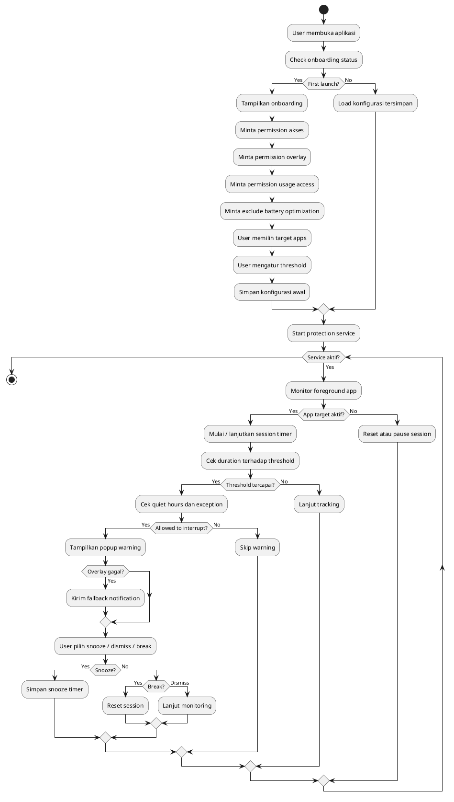
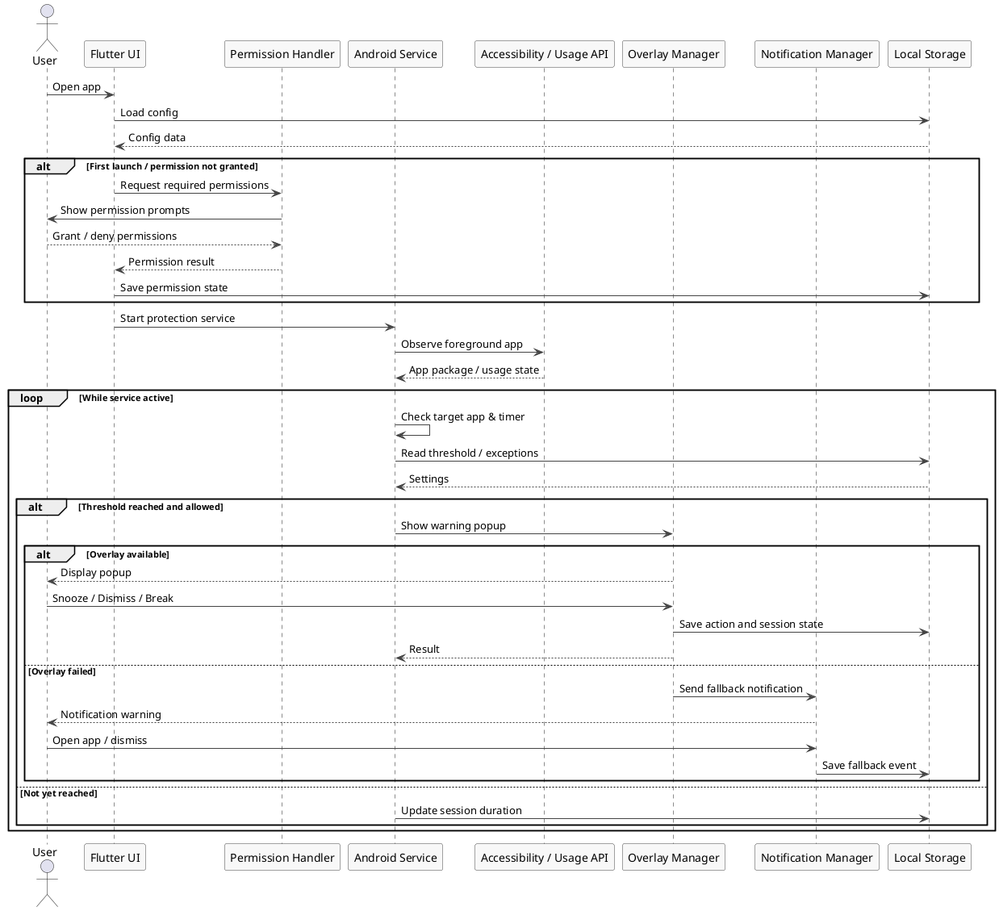
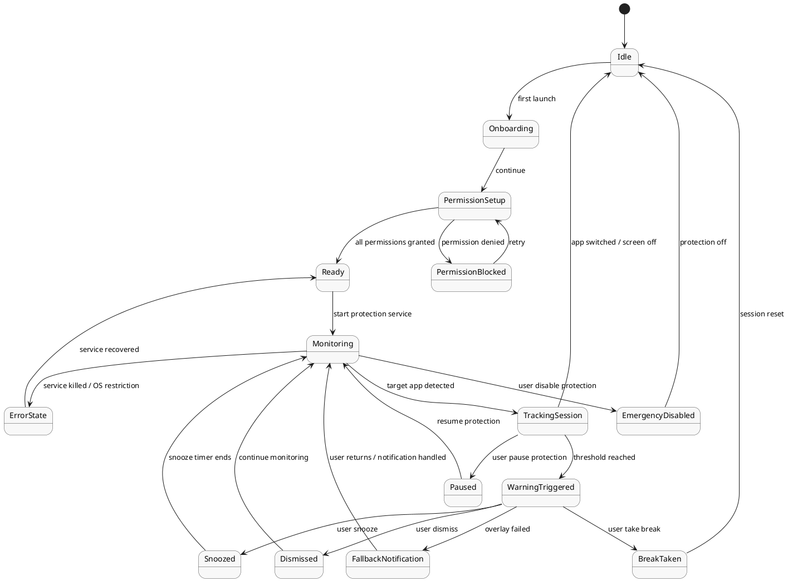

# System Flow Diagram Set

Dokumen ini berisi tiga diagram utama untuk Doomscroll Guard: Activity Diagram, Sequence Diagram, dan State Diagram.

---

## 1. Activity Diagram



---

## 2. Sequence Diagram



---

## 3. State Diagram



---

## 4. Use Case Diagram

```
@startuml
left to right direction
skinparam linetype ortho
skinparam packageStyle rectangle
skinparam actorStyle modern

skinparam usecase {
  BackgroundColor #F8F8F8
  BorderColor #444444
}

actor User
actor "Android OS" as OS

rectangle "Doomscroll Guard System" {

  package "Setup & Configuration" {

    usecase UC1 as "First Launch /\nOnboarding"
    usecase UC2 as "Grant Accessibility\nPermission"
    usecase UC3 as "Grant Usage Access\nPermission"
    usecase UC4 as "Grant Overlay\nPermission"
    usecase UC5 as "Disable Battery\nOptimization"

    usecase UC6 as "Select Target Apps"
    usecase UC7 as "Set Threshold &\nQuiet Hours"
    usecase UC8 as "Manage Whitelist /\nExceptions"
  }

  package "Monitoring Engine" {

    usecase UC9 as "Start Protection\nService"
    usecase UC10 as "Monitor Foreground\nApplication"
    usecase UC11 as "Detect Continuous\nUsage Session"
    usecase UC12 as "Check Rules &\nExceptions"
  }

  package "Intervention System" {

    usecase UC13 as "Trigger Warning\nPopup"
    usecase UC14 as "Send Fallback\nNotification"
    usecase UC15 as "Snooze Warning"
    usecase UC16 as "Dismiss Warning"
    usecase UC17 as "Take Break /\nClose App"
  }

  package "Statistics & Data" {

    usecase UC18 as "View Usage\nStatistics"
    usecase UC19 as "View Daily /\nWeekly Summary"
    usecase UC20 as "Export Usage Data"
    usecase UC21 as "Reset Usage Data"
  }

  package "Control System" {

    usecase UC22 as "Pause Protection"
    usecase UC23 as "Resume Protection"
    usecase UC24 as "Emergency Disable"
  }

  package "Edge Case Handling" {

    usecase UC25 as "Handle Permission\nRevoked"
    usecase UC26 as "Handle Service\nKilled by OS"
    usecase UC27 as "Handle Overlay\nFailure"
    usecase UC28 as "Handle Unsupported\nApplication"
    usecase UC29 as "Handle Screen Off /\nBackground State"
    usecase UC30 as "Handle App Switch /\nSession Reset"
  }
}

' USER RELATIONS
User --> UC1
User --> UC6
User --> UC7
User --> UC8

User --> UC15
User --> UC16
User --> UC17

User --> UC18
User --> UC19
User --> UC20
User --> UC21

User --> UC22
User --> UC23
User --> UC24

' OS RELATIONS
OS --> UC25
OS --> UC26
OS --> UC27
OS --> UC28
OS --> UC29
OS --> UC30

' INCLUDE RELATIONS
UC1 ..> UC2 : <<include>>
UC1 ..> UC3 : <<include>>
UC1 ..> UC4 : <<include>>
UC1 ..> UC5 : <<include>>

UC9 ..> UC10 : <<include>>
UC9 ..> UC11 : <<include>>
UC9 ..> UC12 : <<include>>

UC18 ..> UC19 : <<include>>

' EXTEND RELATIONS
UC13 ..> UC14 : <<extend>>
UC13 ..> UC15 : <<extend>>
UC13 ..> UC16 : <<extend>>
UC13 ..> UC17 : <<extend>>

UC22 ..> UC9 : <<extend>>
UC23 ..> UC9 : <<extend>>

UC24 ..> UC22 : <<extend>>

UC25 ..> UC1 : <<extend>>
UC26 ..> UC9 : <<extend>>
UC27 ..> UC13 : <<extend>>
UC28 ..> UC12 : <<extend>>
UC29 ..> UC11 : <<extend>>
UC30 ..> UC11 : <<extend>>

@enduml
```


## Catatan Alur

- **Activity Diagram** menjelaskan alur proses dari onboarding sampai monitoring dan intervensi.
- **Sequence Diagram** menjelaskan interaksi antar komponen saat aplikasi berjalan.
- **State Diagram** menjelaskan perubahan status utama sistem selama aplikasi aktif.

Diagram ini bisa langsung dipakai sebagai basis laporan atau disesuaikan lagi untuk versi final implementasi.
<<<<<<< HEAD
=======

>>>>>>> 0f27eb3 (git init)
